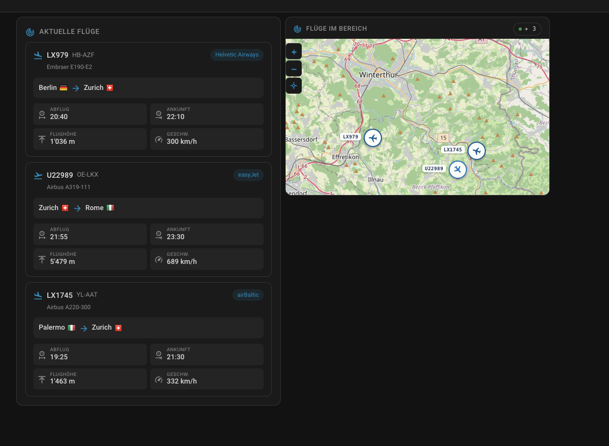
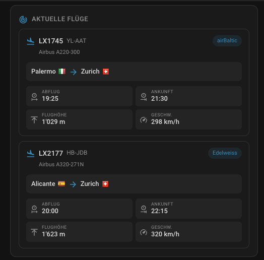
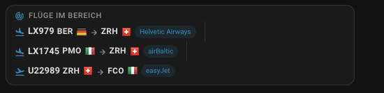
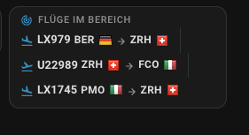
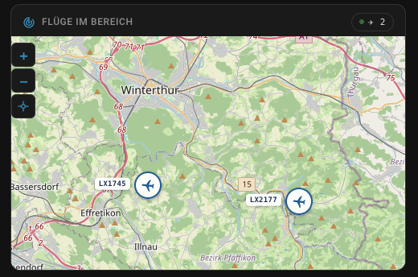
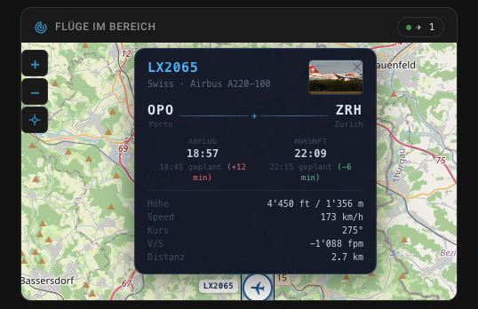

# ✈️ FlightRadar24 Card

[](https://github.com/hacs/integration)
[](https://github.com/piz78/lovelace-flightradar24-card/releases)
[](LICENSE)

A custom Lovelace card for Home Assistant that displays nearby flights from the
[FlightRadar24 integration](https://github.com/AlexandrErohin/home-assistant-flightradar24)
in a clean, theme-aware UI.



Three card types are available:

| Type | Description |
|---|---|
| `custom:flightradar-card` | Full detail view — times, altitude, speed per flight |
| `custom:flightradar-card-compact` | Single-line view — designed for `rows: 1` dashboard tiles |
| `custom:flightradar-card-map` | Interactive Leaflet map — aircraft icons colored by altitude |

---

## Preview

### Full view (`flightradar-card`)



Displays each flight with airline badge, aircraft model, origin/destination with
flags, departure and arrival times, altitude, and ground speed.

### Compact view (`flightradar-card-compact`)

The compact card adapts to the available card width using CSS container queries.

**Wide layout** — all information visible (IATA codes + flags + airline badge):



**Narrow layout** — badge hidden, IATA codes still visible:



> **Icon legend:**  ↗ = departing from home airport · ↙ = arriving at home airport · ✈ = passing through

### Map view (`flightradar-card-map`)

Interactive Leaflet map with OpenStreetMap tiles. Aircraft are shown as circular
badge icons colored by altitude and rotated by heading.



Click any aircraft icon to open a detailed popup with flight number, airline,
aircraft model, optional photo, origin/destination IATA codes and cities,
departure/arrival times, altitude, ground speed, heading, vertical speed, and
distance from your location.



A **reset-view button** below the zoom controls (crosshair icon) returns the map
to the center and zoom level configured in the card settings.

---

## Features

- **Full card view** — departure/arrival times, altitude, ground speed per flight
- **Compact card** — single-line flights, designed for `rows: 1` dashboard tiles
- **Map card** — interactive Leaflet map, altitude-colored aircraft icons, reset-view control
- **HA grid layout** — all cards use `getGridOptions()` for native size control via the Layout tab
- **Progressive display** — airport info adapts to available card width via CSS container queries
- **Home airport awareness** — icon adapts based on flight direction
- **Visual card editor** — no YAML needed, configure via the Lovelace UI
- **`tap_action` support** — navigate, more-info, URL, call-service
- **Theme-aware** — uses HA CSS variables, works in light and dark mode
- **Multilingual** — DE 🇩🇪 · EN 🇬🇧 · FR 🇫🇷 · IT 🇮🇹 (easily extendable)

---

## Requirements

- Home Assistant 2023.0 or newer
- [FlightRadar24 integration](https://github.com/AlexandrErohin/home-assistant-flightradar24)
  installed and configured
- **Compact and map cards:** require a **Sections**-layout dashboard for `grid_options` to take effect

---

## Installation

### Via HACS (recommended)

1. Open **HACS → Frontend**
2. Click the **⋮** menu (top right) → **Custom repositories**
3. Add `https://github.com/piz78/lovelace-flightradar24-card` with
   category **Lovelace**
4. Find **FlightRadar24 Card** → **Download**
5. Reload your browser

> Once the repository is listed in the HACS default store, steps 2 and 3 are
> no longer needed.

### Manual

1. Download the latest release from the
   [Releases page](https://github.com/piz78/lovelace-flightradar24-card/releases)
2. Copy `flightradar-card.js` to `/config/www/`
3. Go to **Settings → Dashboards → Resources**
4. Click **Add resource** and enter:
   - **URL:** `/local/flightradar-card.js`
   - **Type:** JavaScript module
5. Reload your browser

---

## Configuration

### Full card — minimal

```yaml
type: custom:flightradar-card
entity: sensor.flightradar24_fluge_im_bereich
```

### Full card — all options

```yaml
type: custom:flightradar-card
entity: sensor.flightradar24_fluge_im_bereich
title: Flüge im Bereich
home_airport: ZRH
tap_action:
  action: navigate
  navigation_path: /lovelace/flights
```

### Compact card

```yaml
type: custom:flightradar-card-compact
entity: sensor.flightradar24_fluge_im_bereich
home_airport: ZRH
tap_action:
  action: navigate
  navigation_path: /lovelace/flights
grid_options:
  columns: 12
  rows: 1
```

The `grid_options` key is a native HA property and controls the card size in the
dashboard editor's **Layout** tab. The card defaults to `columns: 6, rows: 1`
when added. The minimum is `columns: 6`.

### Map card

```yaml
type: custom:flightradar-card-map
entity: sensor.flightradar24_fluge_im_bereich
home_airport: ZRH
lat: 47.46305
lon: 8.77846
zoom: 11
grid_options:
  columns: 12
  rows: 6
```

The map card defaults to `columns: 12, rows: 6` and requires a **Sections**-layout
dashboard. Leaflet is loaded once from CDN the first time a map card is rendered.

---

## Options

All card types share the base configuration options:

| Option | Type | Default | Description |
|---|---|---|---|
| `entity` | `string` | **required** | The FlightRadar24 sensor entity ID |
| `title` | `string` | *(from language file)* | Card header title |
| `home_airport` | `string` | — | IATA code **or** city name — e.g. `ZRH` or `Zurich` |
| `tap_action` | `action` | — | Action on tap (`flightradar-card` and `flightradar-card-compact` only) |

### Additional options for `flightradar-card-map`

| Option | Type | Default | Description |
|---|---|---|---|
| `lat` | `number` | `47.46305` | Map center latitude |
| `lon` | `number` | `8.77846` | Map center longitude |
| `zoom` | `number` | `11` | Initial zoom level (1–18) |

### `home_airport` matching

The value is compared **case-insensitively** against the IATA code and city name
from the sensor attributes to determine the flight direction icon.

### `tap_action` values

| `action` | Additional keys | Description |
|---|---|---|
| `none` | — | No action (default) |
| `navigate` | `navigation_path` | Navigate to a Lovelace view |
| `more-info` | — | Open the sensor's more-info dialog |
| `url` | `url_path`, `url_target` | Open a URL |
| `call-service` | `service`, `service_data` | Call a HA service |

### Flight direction icons

| Icon | Condition |
|---|---|
| `mdi:airplane-takeoff` | Flight departs **from** the home airport |
| `mdi:airplane-landing` | Flight arrives **at** the home airport |
| `mdi:airplane` | Home airport not involved, or `home_airport` not set |

### Compact card — airport display

The compact card adapts airport labels to the available card width:

| Card width | Displayed |
|---|---|
| ≥ 500 px | IATA code + flag + airline badge |
| 160–499 px | IATA code + flag |
| < 160 px | Flag only |

> On a typical iPhone, 12 columns ≈ 390 px and 6 columns ≈ 195 px.
> Desktop 6 columns ≈ 600 px — IATA codes and airline badges are visible at
> all desktop sizes and at mobile full width; flags only at mobile half width.

---

## Translations

The card automatically selects the language matching `hass.language`.
English is bundled as an inline fallback — the card works even without
translation files present.

| Language | Code | File |
|---|---|---|
| 🇩🇪 German | `de` | `translations/flightradar-card.de.json` |
| 🇬🇧 English | `en` | `translations/flightradar-card.en.json` |
| 🇫🇷 French | `fr` | `translations/flightradar-card.fr.json` |
| 🇮🇹 Italian | `it` | `translations/flightradar-card.it.json` |

### Adding a new language

1. Copy `translations/flightradar-card.en.json`
2. Rename it to `translations/flightradar-card.{lang}.json`
   (use the two-letter language code HA reports, e.g. `es`, `nl`, `pl`)
3. Translate all values — keys must stay in English
4. Submit a pull request 🎉

```json
{
  "editor": {
    "entity":       "Entity",
    "title":        "Card title",
    "home_airport": "Home airport",
    "tap_action":   "Tap action",
    "lat":          "Map center latitude",
    "lon":          "Map center longitude",
    "zoom":         "Map zoom level"
  },
  "editor_helper": {
    "entity":       "FlightRadar24 sensor entity",
    "home_airport": "IATA code or city name (e.g. ZRH or Zurich)",
    "lat":          "Latitude of the map center (e.g. 47.463)",
    "lon":          "Longitude of the map center (e.g. 8.778)",
    "zoom":         "Zoom level 1–18 (default 11)"
  },
  "card": {
    "title_default":    "Flights nearby",
    "no_flights":       "No flights in the area",
    "entity_not_found": "Entity not found",
    "departure":        "Departure",
    "arrival":          "Arrival",
    "altitude":         "Altitude",
    "speed":            "Speed"
  }
}
```

---

## Contributing

Pull requests are welcome!

1. Fork the repository
2. Create a feature branch (`git checkout -b feature/my-improvement`)
3. Commit your changes (`git commit -m 'Add some improvement'`)
4. Push to the branch (`git push origin feature/my-improvement`)
5. Open a Pull Request

For bugs or feature requests, please use the
[issue templates](https://github.com/piz78/lovelace-flightradar24-card/issues/new/choose).

---

## License

[MIT](LICENSE) © 2025 Martin
